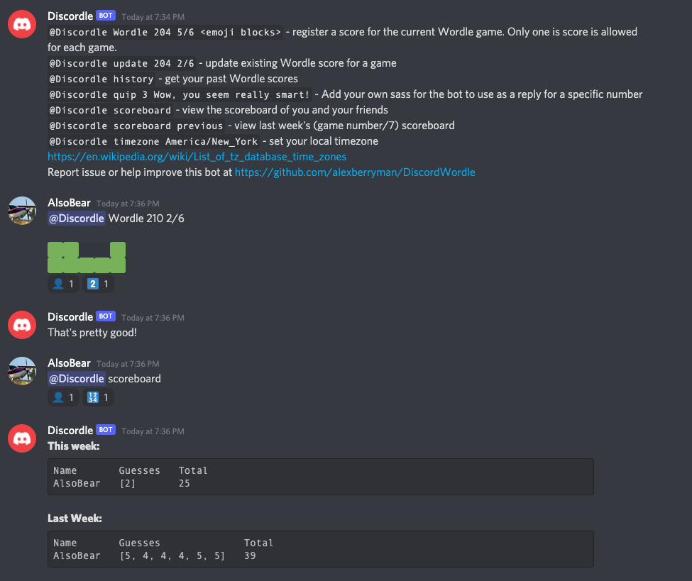

# DiscordWordle

A bot for discord to store and track Wordle scores.

## Usage
Mention the bot using `@BotName help` to see full list of commands:

To add a score just mention the bot followed by pasting the output you get from the Wordle `Share` button. The bot will store this score in a database and let you know if it worked.

## Invite this bot to your Discord Server
Use this Discord link to invite `Discordle` to your server: https://discord.com/api/oauth2/authorize?client_id=929646986125250601&permissions=84032&scope=bot

This bot requests the following permissions:
- Send Messages
- Embed Links
- Read Message History
- Mention Everyone
- Add Reactions

## Get Help
- Ask for help in Discord: 
- Open an issue on GitHub: https://github.com/alexberryman/DiscordWordle/issues

## Deploy your own bot
This project is configured to run on the free-tier of heroku. All you need is an application token from Discord.

1. Go to https://discordapp.com/developers/applications and create a new application. 
1. Provide a name. The name of the application will be used as the bot's name on Discord.
1. Setup bot. Click on the `Bot` tab in the left menu, then click the `Add Bot` button.
    - Choose if you want this bot to be "Public" where anyone with the link can invite it to a different discord server
1. Copy the Bot Token by clicking the `Copy` button under "Token".
1. Use this token as the `DISCORD_TOKEN` when creating a Heroku deployment with the button below.

### Invite your own bot to a server
1. Visit https://discordapp.com/developers/applications and select the bot application.
1. Build a link to invite the bot. Click `OAuth2` in the left-hand menu.
1. Under the "Scopes" section check the `bot` checkbox.
1. Under "Bot Permission" check the following boxes:
    - Send Messages
    - Embed Links
    - Read Message History
    - Mention Everyone
    - Add Reactions
1. Above back in the "Scopes" section `Copy` the generated URL.
1. Paste the URL link into the browser, and pick the Discord server you want the bot to join.
